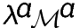

| Branch 1.10                     |
| ------------------------------- |
| [![Lama 1.10][1]][2] |

[1]:  https://github.com/JetBrains-Research/Lama-devel/workflows/Build/badge.svg?branch=1.10
[2]:  https://github.com/JetBrains-Research/Lama-devel/actions


# Lama

 is a programming language developed by JetBrains Research for educational purposes as an exemplary language to introduce
the domain of programming languages, compilers and tools. Its general characteristics are:

* procedural with first-class functions - functions can be passed as arguments, placed in data structures,
  returned and "constructed" at runtime via closure mechanism;
* with lexical static scoping;
* strict - all arguments of function application are evaluated before function body;
* imperative - variables can be re-assigned, function calls can have side effects;
* untyped - no static type checking is performed;
* with S-expressions and pattern-matching;
* with user-defined infix operators, including those defined in local scopes;
* with automatic memory management (garbage collection).

The name  is an acronym for *Lambda-Algol* since the language has borrowed the syntactic shape of
operators from **Algol-68**; [**Haskell**](http://www.haskell.org) and [**OCaml**](http://ocaml.org) can be
mentioned as other languages of inspiration.

The main purpose of  is to present a repertoire of constructs with certain runtime behavior and
relevant implementation techniques. The lack of a type system (a vital feature for a real-word language
for software engineering) is an intensional decision which allows to show the unchained diversity
of runtime behaviors, including those which a typical type system is called to prevent. On the other hand
the language can be used in future as a raw substrate to apply various ways of software verification (including
type systems) on.

The current implementation contains a native code compiler for **x86-32**, written
in **OCaml**, a runtime library with garbage-collection support, written in **C**, and a small
standard library, written in  itself. The native code compiler uses **gcc** as a toolchain.

In addition, a source-level reference interpreter is implemented as well as a compiler to a small
stack machine. The stack machine code can in turn be either interpreted on a stack machine interpreter, or
used as an intermediate representation by the native code compiler.

## Language Specification

The language specification can be found [here](lama-spec.pdf).

## Installation

Windows users should get Windows Subsystem for Linux a.k.a WSL (recommended) or cygwin. Ubuntu-based variant of WSL is recommended.

* System-wide prerequisites:

  - `sudo apt install gcc-multilib` (in Debian-based GNU/Linux)
   
     On some versions you need to install additional package `lib32gcc-9-dev` in case of errors like 
       ```       
      /usr/bin/ld: cannot find -lgcc
      /usr/bin/ld: skipping incompatible /usr/lib/gcc/x86_64-linux-gnu/9/libgcc.a when searching for -lgcc              
       ```
  - [opam](http://opam.ocaml.org) (>= 2.0.4)
  - [OCaml](http://ocaml.org) (>= 4.10.1). *Optional* because it can be easily installed through opam. Compiler variant with `flambda` switch is recommended

* Check that `opam` is installed (using commands `which opam` or `opam --version`)

* Install right [switch](https://opam.ocaml.org/doc/Manual.html#Switches) for OCaml compiler

  `opam switch create lama ocaml-variants.4.10.1+fp+flambda`

  In above command:

  - `opam switch create` is a subcommand to create a new switch
  - `ocaml-variants.4.10.1+fp+flambda` is name of a standart template for the switch
  - `lama` is an alias for the switch being created; on success a directory `$(HOME)/.opam/lama` should be created

* Update PATH variable for the fresh switch. (You can add these commands to your `~/.bashrc` for convenience but they should be added by `opam`)

  ```
  export OPAMSWITCH=lama
  eval $(opam env)
  ```

  Check that OCaml compiler is now available in PATH: running `which ocamlc` should give `/home/user/.opam/lama/bin/ocamlc` (or similar) and `ocamlc -v` should give

  ```
  The OCaml compiler, version 4.10.1
  Standard library directory: /home/user/.opam/lama/lib/ocaml
  ```

* Pin Lama package using `opam` and right URL (remember of "#" being a comment character in various shells)

  `opam pin add Lama https://github.com/JetBrains-Research/Lama-devel.git\#1.10+ocaml4.10 --no-action`

* Install *dep*endencies on system-wide *ext*ernal packages and `lama` itself after that.

  ```
  opam depext Lama --yes
  opam install Lama --yes
  ```

* Check that `lamac` exectuable was installed: `which lamac` should give

  ```
  /home/user/.opam/lama/bin/lamac
  ```

### Smoke-testing (optional)

Clone the repository and run `make -C tutorial`. It should build local compiler `src/lamac` and a few tutorial executables in `tutorial/`.
