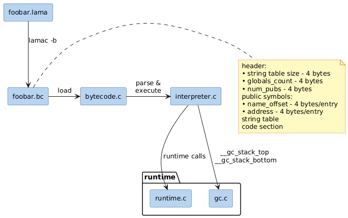

# Lama virtual machine

This directory contains the implementation of the virtual machine for the Lama programming language. The VM is a stack-based execution engine designed to run Lama bytecode.

## Architecture overview (work in progress)

The Lama VM follows a stack-based architecture where operands are pushed onto a data stack, and operations consume these operands and push results back.

(work in progress, each iteration the architecture will change)
### Key Components

*   **Interpreter (`interpreter.c`)**: The core execution loop that fetches, decodes, and executes bytecode instructions.
*   **Data stack (`stack.c`, `stack.h`)**: A growable stack used for evaluating expressions, passing function arguments, and storing local variables.
*   **Call stack (`call_stack.c`, `call_stack.h`)**: Manages function activation records (frames), tracking return addresses and stack base pointers.
*   **Instruction set (`opcodes.h`)**: Defines the bytecode opcodes 

### Interaction with Runtime

The VM is tightly integrated with the Lama runtime (`../runtime/`). It relies on the runtime for:
*   **Memory management**: Automatic garbage collection for heap-allocated objects.
*   **Built-in functions**: IO operations (read/write), array/S-expression/string handling.

## Bytecode format

The VM executes a dense bytecode format where each instruction consists of a 1-byte opcode followed by optional immediate values or offsets. Function definitions include metadata about the number of arguments and local variables required.
