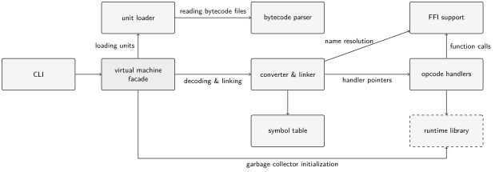

#  virtual machine

This directory contains the implementation of the virtual machine for the  programming language.

Documentation is split as follows:

* [`SPEC.md`](SPEC.md) - bytecode file format and instruction reference.
* [`README.md`](README.md) - implementation overview, build instructions, and command-line usage.

## Build

```bash
# Release
make

# Debug
make debug

# Remove build artifacts
make clean
```

## Usage

The input can be a path to the main `.bc` file:

```bash
./lama.exe Main.bc
```

or a unit name:

```bash
./lama.exe Main
```

When a `.bc` path is used, its directory is added as the first unit search path.
When a unit name is used, the VM searches only the paths passed with `-I`.

You can also add directories to the list of searched paths for imported modules:

```bash
./lama.exe -I stdlib/ -I lib/ Main
```

Program arguments are passed after the unit name or `.bc` path:

```bash
./lama.exe -I stdlib/ Main arg1 arg2
./lama.exe Main.bc arg1 arg2
```

To print bytecode metadata and instructions without executing the program:

```bash
./lama.exe --disassemble Main.bc
```

Run `./lama.exe --help` for the full list of command-line options.

## Architecture



The figure shows the main components of the virtual machine and the relationships between them. The command-line interface (CLI) is the external entry point: it receives the parameters and passes control to the virtual machine facade. The facade coordinates the remaining components: it loads bytecode files, decodes and links them and prepares its garbage collector.

The virtual machine follows a stack-based architecture where operands are pushed onto the operand stack, and operations consume these operands and push their results back onto it.
